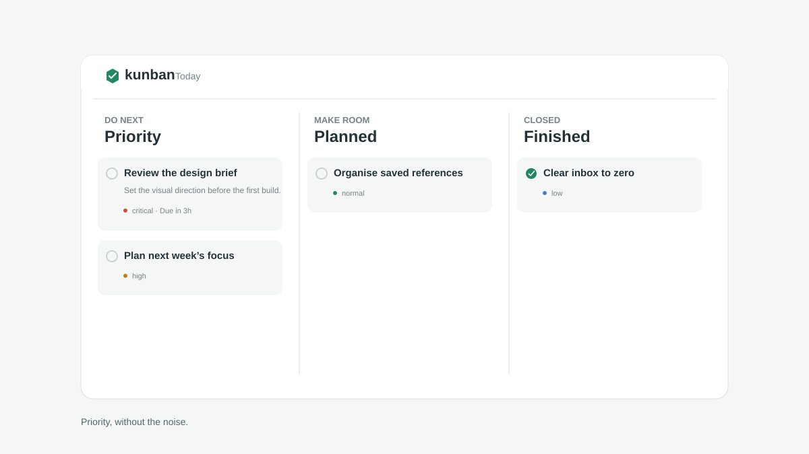

# Kunban

> A quiet, desktop-native Kanban board that keeps the next commitment in view.



Kunban is a personal Windows desktop widget, not another browser tab. It sits outside the taskbar, opens as a compact priority list, and expands into a full board only when you pause over it. The result is a board that is useful at a glance without permanently demanding screen space.

## Why Kunban

- **Priority-first by default** — the compact widget shows your most important work in order.
- **Intentional depth** — hover briefly to reveal Priority, Planned, and Finished stacks.
- **Native desktop behaviour** — frameless, always-on-top, taskbar-free Electron window with no maximise/minimise chrome.
- **Automation-ready, privacy-aware** — browser websites may request one new card; local MCP clients get full loopback-only read/write control without a setup key.
- **Personal by design** — data remains in the Windows app-data directory as a local JSON file.

## Quick start

Requirements: Node.js 20+ and Windows 10/11.

```bash
npm install
npm run dev
```

For a production build:

```bash
npm run package:win
```

The installer and portable executable are written to `release/`.

## The local integration model

Kunban starts a loopback-only API at `http://127.0.0.1:7400`. The memorable default can be overridden with `KUNBAN_PORT`. It intentionally has two trust levels:

| Surface | Access | Purpose |
| --- | --- | --- |
| `GET /api/info` | Public, safe metadata | Lets an integration discover whether Kunban is available. |
| `POST /api/web/cards` | Browser CORS, create only | Lets a site request a single priority card without reading private data. |
| `/api/local/*` | Loopback, no credentials | Full card read/write control for processes on this device. |
| MCP (stdio) | No setup key | A standard tool interface for local AI clients. |

The API is bound to `127.0.0.1` — it is never exposed to a LAN. Browser requests remain limited to the narrow create-only endpoint; full local API requests reject non-local browser origins, while local processes and MCP clients can use the board directly without credentials.

### Website card request

This is deliberately the only route that a website can call. It does not reveal any board data.

```js
await fetch('http://127.0.0.1:7400/api/web/cards', {
  method: 'POST',
  headers: {
    'Content-Type': 'application/json',
    'X-Kunban-Intent': 'create-card'
  },
  body: JSON.stringify({
    title: 'Complete the frontend assessment',
    details: 'Role: Product Engineer',
    priority: 'high',
    dueAt: '2026-08-02T17:00:00.000Z'
  })
});
```

Accepted fields are `title`, `details`, `priority`, and `dueAt`. Requests always create in the Priority stack, are size-limited, and are capped at 20 requests per origin per minute.

### MCP setup

Register the following command with an MCP-compatible AI client:

```json
{
  "mcpServers": {
    "kunban": {
      "command": "npx",
      "args": ["tsx", "C:/path/to/Kunban/src/mcp/server.ts"],
      "env": { "KUNBAN_PORT": "7400" }
    }
  }
}
```

The MCP server exposes `list_cards`, `create_card`, and `update_card`. It communicates with Kunban over the loopback-only local API; no remote service or user-managed key is involved.

## Development

```bash
npm run check      # Type-check renderer, Electron, and MCP code
npm run build      # Build web UI and Electron main process
npm run package:win
```

## Roadmap

- Board profiles and per-project filters
- Optional encrypted local store
- User-approved web source allowlist
- Taskbar tray control and launch-at-login preference

## License

[MIT](LICENSE)
